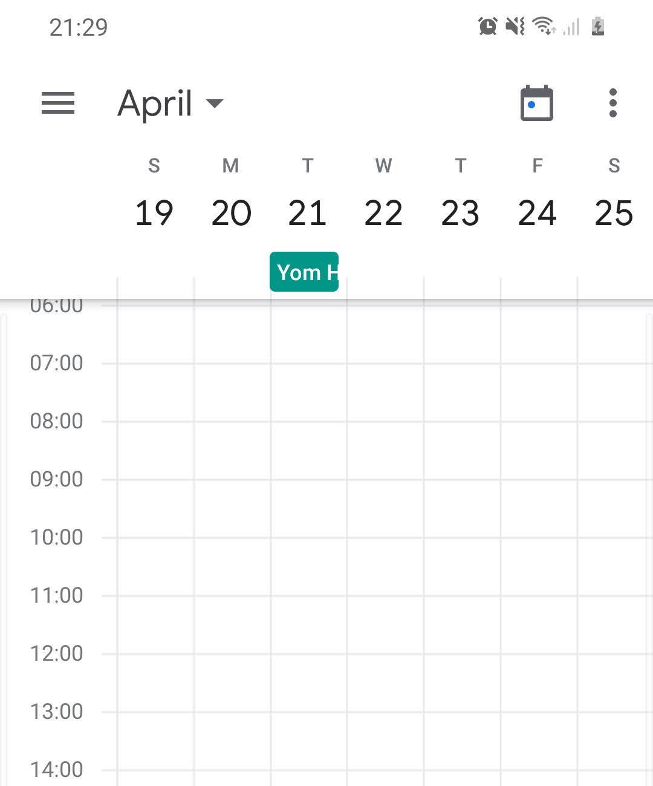
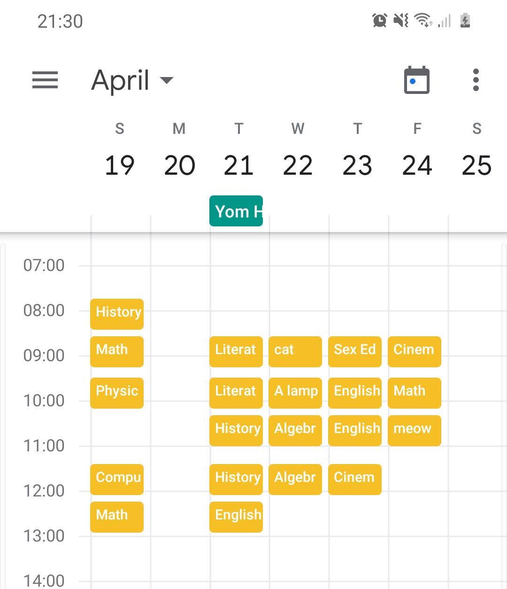

# Time-Table
### A script that takes a google sheets spreadsheet and puts the data in google calendar 

## Write scedule in google sheet named "Time Table"

## Run script

## Magic just happened
|  |  -> |  |
| ----------------------------------------- | --- | ----------------------------------------- |

note that the script requires the folowing files:
- client_secret.json
- sheets_secret.json
 

